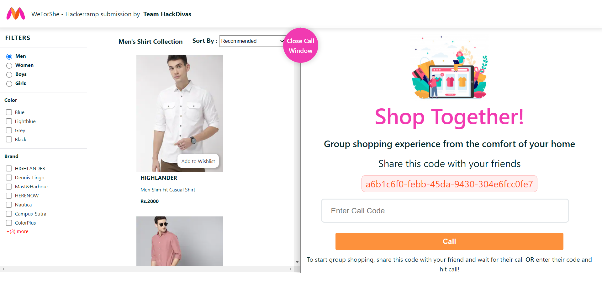
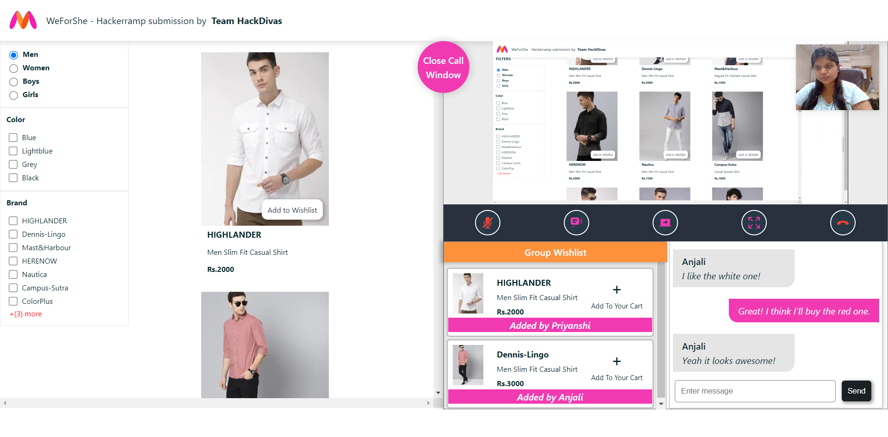

# WeForShe | Submission of Team HackDivas
<b>Theme:
Collaborative Shopping</b>

    
  </a>
  
Through our proposed solution, we have tried to build a platform that enables the user to do collaborative shopping and have attempted to provide the same experience of shopping as they would have had in person together at the comfort of sitting at home. Ours is a unique meeting app, where users can share screens where the screen actually has the store. We aim at providing with a platform where one can easily share their opinnions, ideas and seek suggestions from friends and family in real time. Also, we are trying to prevent the inconvenience of using differnt apps for communication, hence a one stop platform from browsing to sharing to ultimately buying, making it a unique and hassle-free experience. Check it out [here](https://hackdivas-shopping.herokuapp.com/).

## Tech Stack
* <b>React</b> - ***Used to build the Frontend of the application*** wherein **HTML, CSS** were used to design of the Interface
    * It ensures faster rendering, thereby also ensuring a nice UI/UX
    * Adding to the UI/UX, we don’t need to reload in our app, as we are making a single page application with React.
    * It is independent of platform
*  **WebRTC** - This is state of the art multimedia streaming technology developed by Google and Ericsson. ***This is used to form connection between the users on our platform.***
    * It uses secure and advanced audio and video.
    * Its independent of platform and device and doesn’t need additional software.

* <b>Node.js</b> - ***Backend of the application to create the server for connecting users.***
    * It offers high performance for real time applications, which is exactly what we need.
    * Socket.io is a javascript library i.e. compatible with node.js 
    * It is Robust and Scalable.
 
* <b>Socket.io</b> - ***To open a communication session between multiple users and facilitate screen sharing, chat, group wishlist et cetera.,*** in real-time.
    * It works on all platforms, servers or device, ensuring equality, reliability, and speed.
    * It is a JavaScript Library i.e. compatible with node.js
    
* **simple-peer** - A javascript library which acts as a wrapper around WebRTC and ***used to make peer to peer connection***.

## Features
* <b>Group Video Call</b> - The participants can get together virtually over a video call, hence giving the shopping experience a corporeal feel.   
* <b>Screen Share</b> - The user has the feasibility of sharing one’s screen with the other participants, so that they get to show the products they like and seek suggestions.
* <b>Group Wish List</b> -where everyone can save, suggest, add and view items introducing visibility and accessibility to each other’s choices.
* <b>Group Chat</b>- We have provided the users with chat feature where they can share their ideas and thoughts in real time, while still sharing their screens.
* **Immediate Store Access** - Access to the Myntra Store while collaborating with  each individual on call.

## A Glimpse

    
    

## Team HackDivas

* [Priyanshi Sharma](https://github.com/priyanshisharma)
* [Anjali Patle](https://github.com/AnjaliPatle)
* [Sakshi Bhandarkar](https://github.com/sakshi300699)
