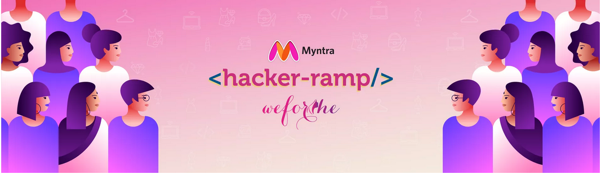

# WeForShe | Submission of Team HackDivas
<b>Theme:
Collaborative Shopping</b>

    
  </a>
  
Through our proposed solution, we have tried to build a platform that enables the user to do collaborative shopping and have attempted to provide the same experience of shopping as they would have had in person together at the comfort of sitting at home. Ours is a unique meeting app, where users can not only share screens but can also remotely access each other’s screens where the screen actually has the store. We aim at providing with a platform where one can easily share thier oppinions, ideas and seek suggestions from friends and family in real time. Also, we are trying to prevent the inconvinience of using differnt apps for commincation, hence a one stop platform from browsing to sharing to ultimately buying, making it a unique and hassle-free experience.

## Tech Stack
* <b>React</b> - Frontend of the application
* <b>HTML, Bootstrap, CSS</b> - Design of the Interface 
* <b>Node.js</b> - Backend of the application 
* <b>Socket.io</b>- To open a communication session between multiple users and facilitate screen sharing and access.
